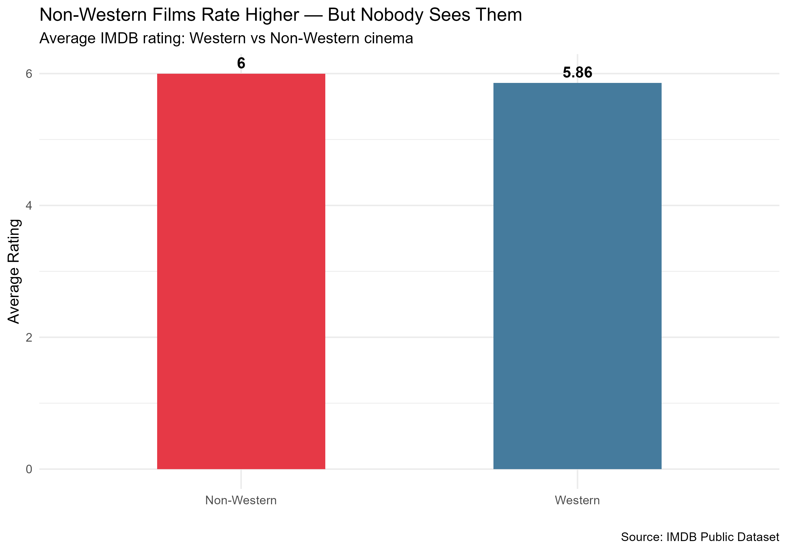
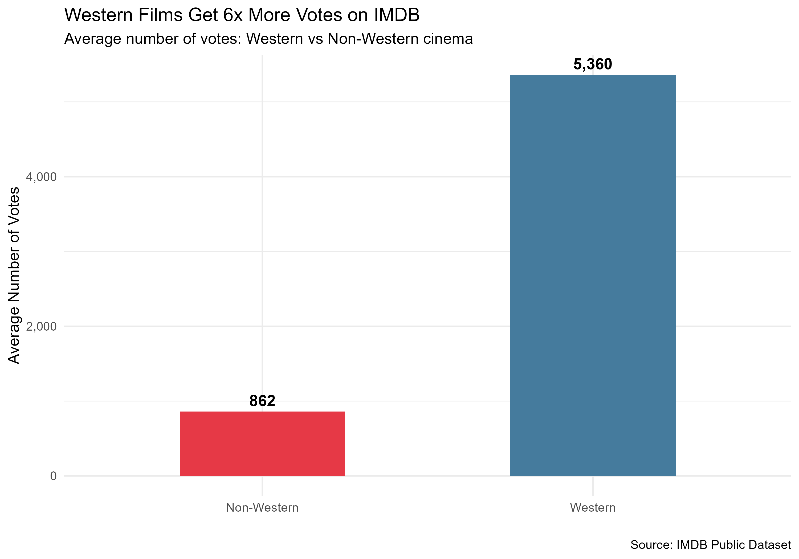
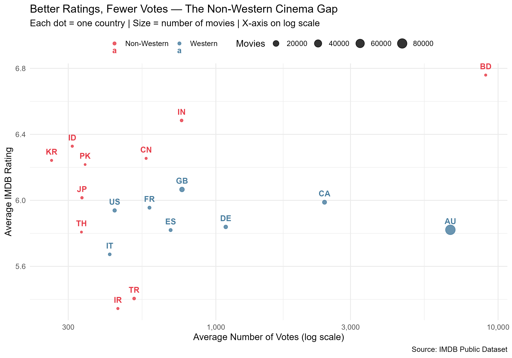

# IMDB Cinema Bias Analysis

## Finding
Non-Western films consistently rate higher than Western films on IMDB — 
but receive 6x fewer votes, making them virtually invisible.

## Key Results
- Bangladesh ranks #1 in average IMDB rating (6.8)
- Non-Western films average rating: 6.00 vs Western: 5.86
- Western films average 5,360 votes vs Non-Western: 862
- Dataset: 350,000+ movies from IMDB public dataset

## Charts

## Tools Used
- R
- tidyverse, ggplot2, dplyr

## Data Source
IMDB Public Dataset — datasets.imdbws.com
